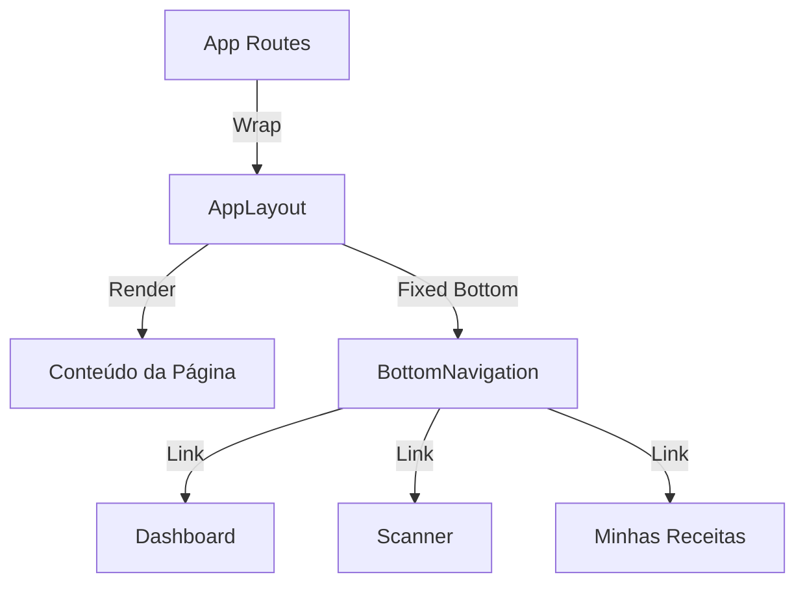

# Barra de Navegação Persistente

## Objetivo
Implementar uma barra de menu (Bottom Navigation) visível nas principais telas do aplicativo para facilitar a navegação rápida.

---

## Arquitetura

---

## Proposed Changes

### 1. Componente de Navegação

#### [NEW] [BottomNav.jsx](file:///c:/Users/emanu/Documents/Projetos/Já comprei/frontend-ja-comprei/src/components/BottomNav.jsx)
- **Estilo:** Barra fixa na parte inferior (estilo app mobile).
- **Itens:**
  - **Home/Dashboard:** (`/dashboard`) - Ícone Home
  - **Nova Compra:** (`/scanner`) - Ícone Scan/Camera (Destaque?)
  - **Receitas:** (`/minhas-receitas`) - Ícone Book/Heart
- **State:** Identificar rota ativa para highlight.

#### [NEW] [AppLayout.jsx](file:///c:/Users/emanu/Documents/Projetos/Já comprei/frontend-ja-comprei/src/components/AppLayout.jsx)
- Wrapper que recebe `children`.
- Renderiza o conteúdo com padding inferior (para não ficar atrás da barra).
- Renderiza `BottomNav` condicionalmente (ou sempre, exceto Landing Page).

### 2. Refatoração de Rotas

#### [MODIFY] [App.jsx](file:///c:/Users/emanu/Documents/Projetos/Já comprei/frontend-ja-comprei/src/App.jsx)
- Importar `AppLayout`.
- Envolver as rotas principais neste Layout:
  - `/dashboard`
  - `/scanner` (e fluxo de scan?)
  - `/lista`
  - `/minhas-receitas`
  - `/receita/*`
- **Exceção:** `/` (LandingPage) deve ficar fora do Layout.

---

## Verification Plan

### Manual Verification
1. Abrir o app (Dashboard).
2. Verificar se a barra aparece embaixo.
3. Navegar para "Scanner" pela barra.
4. Navegar para "Minhas Receitas" pela barra.
5. Voltar para "Home".
6. Verificar se a barra NÃO aparece na Landing Page (logout).

---

## Checklist

- [x] Criar componente `BottomNav.jsx`
- [x] Criar componente `AppLayout.jsx`
- [x] Refatorar `App.jsx` para usar o Layout
- [x] Ajustar paddings das páginas existentes para acomodar a barra
