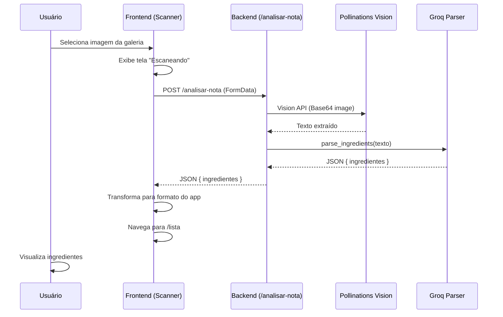

# Plano de Implementação: Conexão OCR Scanner (Frontend ↔ Backend)

**Objetivo:** Conectar a funcionalidade de Scanner no Frontend à API de OCR no Backend, permitindo que imagens de notas fiscais sejam processadas pelo Pollinations Vision e os ingredientes extraídos sejam exibidos na Lista de Compras.

---

## Análise do Estado Atual

### Backend (`recipe_router.py`)
✅ Endpoint `POST /api/analisar-nota` já existe e:
- Recebe `UploadFile` (multipart/form-data).
- Valida extensão de imagem (.png, .jpg, etc.).
- Chama `ai_orchestrator.process_receipt_image(content)`.
- Retorna JSON com `ingredientes`.

### Frontend (`api.ts`)
❌ `api.parseNota()` é um **placeholder** que retorna array vazio.

### Frontend (`App.jsx`)
❌ `handleScan()` usa `setTimeout` com dados **mockados**.

---

## Passos de Implementação

### Frontend - Tela de Seleção

- [ ] **0. [NEW] `ScanMethodModal.jsx`**: Criar modal de seleção de método de captura
    - **UX:** Bottom Sheet / Modal centralizado, fundo escurecido, transição suave.
    - **Conteúdo:**
      - Título: "Como você quer adicionar?"
      - Opção 1: **📸 Escanear com Câmera**
        - Ícone de câmera grande
        - Badge: "Em breve" (subtle, corner badge)
        - Estado: `disabled`, cor esmaecida
        - Tooltip/subtext: "Capture sua nota ao vivo"
      - Opção 2: **📁 Enviar da Galeria**
        - Ícone de imagem/upload grande
        - Estado: `enabled`, cor vibrante (destaque)
        - Subtext: "Selecione uma foto existente"
    - **Ação:**
      - Clicar em "Galeria" → Abre seletor de arquivos → `onFileSelect(file)`.
      - Clicar em "Câmera" → Nada (disabled) ou toast "Em breve!".
    - **Fechamento:** Clicar fora ou botão "X" fecha o modal.

- [ ] **1. [MODIFY] `Scanner.jsx`**: Substituir interface atual por acionador do modal
    - Ao invés de mostrar a câmera diretamente, exibir uma tela simples com:
      - Header com botão voltar
      - Centro: Botão grande "Adicionar Nota/Recibo" que abre o `ScanMethodModal`
    - **Alternativa (manter câmera em background):**
      - Manter a câmera ativa como "preview" de fundo
      - Mostrar o Modal por cima ao clicar em qualquer botão de ação
      - *Decisão de UX: Escolher a abordagem mais limpa*

---

### Frontend - API e Conexão

- [ ] **2. [MODIFY] `api.ts`**: Implementar `parseNota()` real
    ```typescript
    async parseNota(file: File) {
        const formData = new FormData();
        formData.append('file', file);

        const response = await fetch(`${API_URL}/analisar-nota`, {
            method: 'POST',
            body: formData,
        });

        if (!response.ok) {
            throw new Error(`Erro na API: ${response.statusText}`);
        }

        return await response.json();
    }
    ```

- [ ] **3. [MODIFY] `App.jsx`**: Conectar `handleScan()` à API real
    ```javascript
    const handleScan = async (file) => {
        navigate('/scanning');

        try {
            if (file) {
                const result = await api.parseNota(file);
                const formattedIngredients = result.ingredientes.map((ing, idx) => ({
                    id: idx + 1,
                    name: ing.item,
                    quantity: ing.quantidade || '',
                    checked: true,
                }));
                setIngredients(formattedIngredients);
            } else {
                setIngredients(mockIngredients);
            }
            navigate('/lista');
        } catch (error) {
            console.error("Erro OCR:", error);
            alert("Erro ao processar imagem. Tente novamente.");
            navigate('/scanner');
        }
    };
    ```

- [ ] **4. (Futuro) Captura via Câmera**: Converter frame da câmera para Blob
    - **ESCOPO FORA** desta track (foco no upload de galeria).
    - Será habilitado quando o badge "Em breve" for removido.

---

## Verificação

### Manual
1.  Acessar `/scanner` no app.
2.  Clicar no ícone de **Galeria** (inferior esquerdo).
3.  Selecionar uma imagem de nota fiscal ou lista de compras.
4.  **Esperado:** Tela de "Escaneando" aparece enquanto processa.
5.  **Esperado:** Após OCR, redireciona para `/lista` com os ingredientes extraídos.
6.  Verificar se os nomes e quantidades estão corretos na lista.

### Teste de Erro
1.  Enviar uma imagem ilegível ou documento não-relacionado.
2.  **Esperado:** Mensagem de erro amigável e retorno ao Scanner.

---

## Fluxo de Dados



