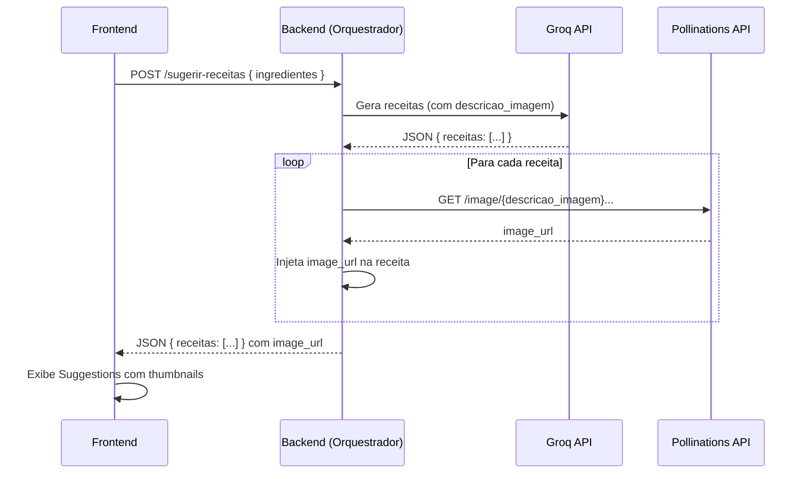

# Plano de Implementação: Receitas com Imagens Coerentes + UX de Espera Aprimorada [Concluído]

**Objetivo:** Garantir que as imagens geradas pela Pollinations sejam **coerentes** com a receita (via descrição no prompt Groq), melhorar a experiência de **espera** do usuário durante a geração das imagens, e assegurar a **visualização correta** da receita pronta.

---

## Escopo

### O que está incluso:
1.  **Backend: Nova propriedade `descricao_imagem`** no retorno do Groq para cada receita.
2.  **Backend: Orquestrador usa `descricao_imagem`** como prompt para o Pollinations.
3.  **Frontend: Carrossel de Dicas** na tela de loading (`Analyzing.jsx`).
4.  **Frontend: Verificar `RecipeDetail.jsx`** para garantir exibição correta da imagem e dados.

### O que NÃO está incluso:
- Geração de vídeos.
- Alterações na lógica de OCR/Vision (já funcional).

---

## Análise do Estado Atual

### Backend (`groq_service.py` - linha 75)
```python
# Prompt atual:
"Você é um Chef Brasileiro Criativo. Crie 3 receitas detalhadas..."
# Retorna: nome_do_prato, tempo_preparo, ingredientes_usados, modo_de_preparo
```
**Falta:** Campo para descrição visual da imagem.

### Backend (`ai_orchestrator.py` - linha 49-50)
```python
# Prompt atual para imagem:
prompt = f"Professional food photography: {dish_name}. High quality..."
```
**Problema:** Usa apenas o nome do prato, sem contexto visual detalhado. Resultado: imagens podem não corresponder à receita.

### Frontend (`Analyzing.jsx`)
Loading estático com animação de vapor. **Falta:** Conteúdo dinâmico (carrossel) para engajar o usuário durante a espera mais longa.

### Frontend (`RecipeDetail.jsx`)
Já exibe `recipe.image_url` (linha 10). **Status:** Funcional, apenas verificar se os novos campos aparecem.

---

## Passos de Implementação

### Backend

- [ ] **1. [MODIFY] `groq_service.py`**: Atualizar prompt de `generate_recipes`
    - Adicionar ao prompt: `"descricao_imagem": "Uma frase descritiva da aparência final do prato para gerar uma foto (ex: 'Prato de macarrão ao molho vermelho com manjericão fresco e queijo ralado')"`
    - Exemplo de retorno esperado:
      ```json
      {
        "receitas": [
          {
            "nome_do_prato": "...",
            "tempo_preparo": "...",
            "ingredientes_usados": [...],
            "modo_de_preparo": [...],
            "descricao_imagem": "Uma foto de um sanduíche artesanal com queijo derretido, alface crocante e tomate fresco."
          }
        ]
      }
      ```

- [ ] **2. [MODIFY] `ai_orchestrator.py`**: Usar `descricao_imagem` no prompt do Pollinations
    - Alterar linha ~49-50 para:
      ```python
      image_description = recipe.get("descricao_imagem", f"Prato delicioso: {dish_name}")
      prompt = f"{image_description}. Professional food photography, natural lighting, restaurant style, 4k"
      ```

---

### Frontend

- [ ] **3. [MODIFY] `Analyzing.jsx`**: Adicionar Carrossel de Dicas Culinárias
    - Criar um array de dicas/curiosidades (ex: "Você sabia? O tomate é uma fruta!", "Dica: Tempere a carne 30 min antes de fritar").
    - Usar `useState` + `useEffect` com `setInterval` para trocar a dica a cada 4-5 segundos.
    - Exibir abaixo do texto "O Chef está analisando..." com animação de fade.
    - Adicionar indicador de passos: "Etapa 1/2: Criando receitas..." → "Etapa 2/2: Gerando imagens...".

- [ ] **4. [VERIFY] `RecipeDetail.jsx`**: Confirmar exibição da imagem gerada
    - Já usa `recipe.image_url || recipe.image`.
    - Testar se a imagem carrega corretamente após o fluxo completo.

- [ ] **5. (Opcional) `App.jsx`**: Passar status de loading para `Analyzing.jsx`
    - Se quiser mostrar "Gerando imagens..." separadamente, pode-se criar um estado `loadingStep: 'recipes' | 'images'` e passar como prop.

---

## Verificação

### Manual
1.  Selecionar ingredientes e clicar em "Gerar Receitas".
2.  **Esperado:** Tela de loading mostra carrossel de dicas rotativas.
3.  Após alguns segundos, receitas aparecem com thumbnails.
4.  **Esperado:** As imagens correspondem visualmente às descrições das receitas (ex: se a receita é um sanduíche, a imagem mostra um sanduíche, não uma sopa).
5.  Clicar em "Ver Receita".
6.  **Esperado:** Imagem grande, título, ingredientes e modo de preparo corretamente exibidos.

---

## Fluxo de Dados Atualizado



