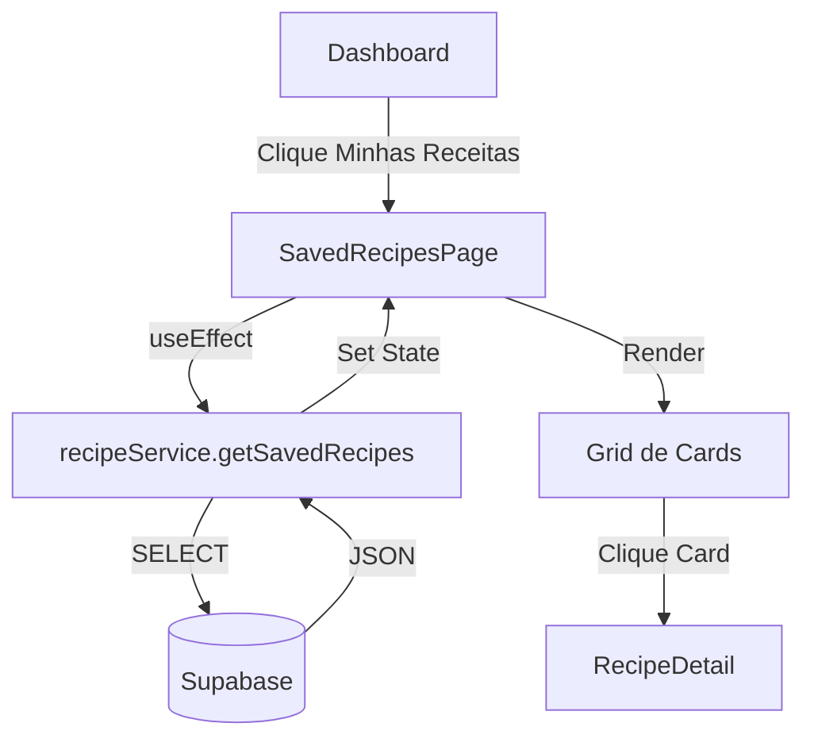

# Página Minhas Receitas

## Objetivo
Criar uma interface para o usuário visualizar, acessar e gerenciar suas receitas salvas no Supabase.

---

## Arquitetura

---

## Proposed Changes

### 1. Serviço de Leitura (Supabase)

#### [MODIFY] [recipeService.js](file:///c:/Users/emanu/Documents/Projetos/Já comprei/frontend-ja-comprei/src/services/recipeService.js)
- Adicionar função `getSavedRecipes(userId)`.
- Query: `SELECT * FROM recipes WHERE user_id = ? ORDER BY created_at DESC`.

### 2. Nova Página: Minhas Receitas

#### [NEW] [SavedRecipesPage.jsx](file:///c:/Users/emanu/Documents/Projetos/Já comprei/frontend-ja-comprei/src/pages/SavedRecipesPage.jsx)
- **Header:** Título "Livro de Receitas" ou "Minhas Criações".
- **Estado:** `loading`, `recipes`, `error`.
- **Logic:** Buscar receitas no mount usando `user.id` do contexto.
- **Empty State:** "Você ainda não salvou nenhuma receita." com botão para ir ao Scanner.
- **Grid:** Renderizar cards (reutilizar estilo do `Suggestions.jsx` ou criar componente `RecipeCard`).

### 3. Rotas e Navegação

#### [MODIFY] [App.jsx](file:///c:/Users/emanu/Documents/Projetos/Já comprei/frontend-ja-comprei/src/App.jsx)
- Importar `SavedRecipesPage`.
- Adicionar rota `/minhas-receitas`.

#### [MODIFY] [Dashboard.jsx](file:///c:/Users/emanu/Documents/Projetos/Já comprei/frontend-ja-comprei/src/components/Dashboard.jsx)
- Atualizar o card "Minhas Receitas" (estava como "Minhas Listas" ou similar? Validar nome).
- Apontar rota para `saved-recipes` (ou `/minhas-receitas`).
- Atualizar contador "Receitas salvas" para usar dado real (opcional/bônus).

---

## Verification Plan

### Manual Verification
1. Abrir Dashboard.
2. Clicar no card "Minhas Receitas" (ou similar).
3. Verificar se carrega a lista.
4. Validar se a receita recém-salva aparece.
5. Clicar em uma receita e verificar se abre os detalhes corretamente.
6. Verificar comportamento se não houver receitas (Empty State).

---

## Checklist

- [x] Implementar `getSavedRecipes` em `recipeService.js`
- [x] Criar `SavedRecipesPage.jsx`
- [x] Configurar rota `/minhas-receitas` em `App.jsx`
- [x] Linkar botão do `Dashboard.jsx` para a nova rota
