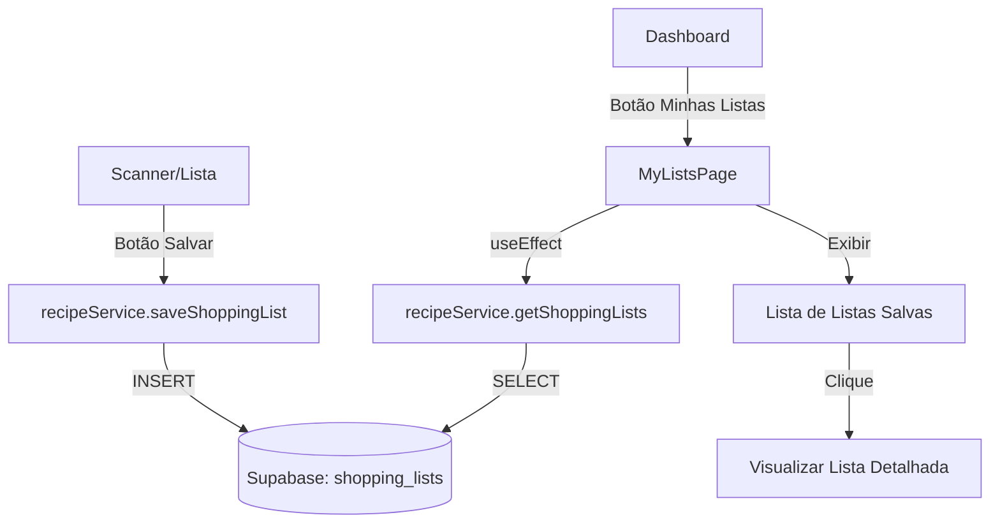

# Persistência de Listas de Compras

## Objetivo
Permitir que o usuário salve suas listas de compras (escaneadas ou criadas manualmente) para consulta posterior, e facilitar o acesso a essas listas através do Dashboard.

---

## Arquitetura

## Banco de Dados (Supabase)

Tabela `shopping_lists`:
- `id` (uuid, primary key)
- `user_id` (uuid, foreign key)
- `title` (text, default: "Lista de Compras {Date}")
- `items` (jsonb array: `[{name, quantity, checked}]`)
- `created_at` (timestamptz)

---

## Proposed Changes

### 1. Serviço de Lista (Frontend)

#### [MODIFY] [recipeService.js](file:///c:/Users/emanu/Documents/Projetos/Já comprei/frontend-ja-comprei/src/services/recipeService.js)
- `saveShoppingList(userId, listTitle, items)`
- `getShoppingLists(userId)`
- `deleteShoppingList(listId)`

### 2. UI: Salvar Lista Atual

#### [MODIFY] [ShoppingList.jsx](file:///c:/Users/emanu/Documents/Projetos/Já comprei/frontend-ja-comprei/src/components/ShoppingList.jsx)
- Adicionar botão **"Salvar Lista"** no cabeçalho ou rodapé.
- O botão deve abrir um prompt/modal para nomear a lista (opcional, ou usar data automática) e chamar `saveShoppingList`.
- Atual: O botão flutuante é "Sugerir Receitas". O novo botão deve conviver ou ser uma ação secundária no header.

### 3. Nova Página: Minhas Listas

#### [NEW] [MyListsPage.jsx](file:///c:/Users/emanu/Documents/Projetos/Já comprei/frontend-ja-comprei/src/pages/MyListsPage.jsx)
- Listagem das listas salvas.
- Ao clicar, expande ou navega para ver os itens.
- Permite excluir listas antigas.

### 4. Dashboard e Navegação

#### [MODIFY] [Dashboard.jsx](file:///c:/Users/emanu/Documents/Projetos/Já comprei/frontend-ja-comprei/src/components/Dashboard.jsx)
- **RENOMEAR** card "Gerar Receitas" (`ChefHat`) para **"Minhas Listas"** (`ClipboardList` ou similar).
- Mudar rota de `suggestions` (que está errada como ponto de partida) para `/minhas-listas`.
- **Nota:** O acesso a "Sugestões/Gerar Receitas" continuará existindo através do fluxo do Scanner -> Lista -> Sugerir.

#### [MODIFY] [App.jsx](file:///c:/Users/emanu/Documents/Projetos/Já comprei/frontend-ja-comprei/src/App.jsx)
- Adicionar rota `/minhas-listas` apontando para `MyListsPage`.

---

## Verification Plan

1. **Criar Tabela:** Rodar SQL no Supabase para criar `shopping_lists` e políticas RLS.
2. **Salvar:** Escanear nota (ou mock), adicionar itens, clicar em Salvar. Verificar no banco.
3. **Listar:** Ir ao Dashboard -> Minhas Listas. Verificar se a lista salva aparece.
4. **Detalhes:** Clicar na lista e ver os itens.

---

## Checklist

- [x] Executar SQL para criar tabela `shopping_lists` no Supabase
- [x] Implementar funções de persistência em `recipeService.js`
- [x] Adicionar botão de salvar em `ShoppingList.jsx`
- [x] Criar `MyListsPage.jsx`
- [x] Atualizar rota e card no `Dashboard.jsx` (Renomear para Minhas Listas)
- [x] Adicionar rota no `App.jsx`
