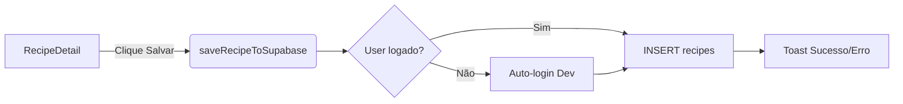

# Persistência de Receitas no Supabase

## Objetivo
Conectar o frontend ao Supabase para permitir que o usuário salve as receitas geradas pela IA no banco de dados.

---

## User Review Required

> [!IMPORTANT]
> **Dev Mode Auth:** Estamos implementando um login automático hardcoded para desenvolvimento. Isso DEVE ser removido antes do deploy em produção.

> [!NOTE]
> **Pré-requisitos:** A tabela `recipes` já existe com RLS ativo. O usuário `dev@jacomprei.com` deve existir no Supabase Auth.

---

## Tech Debt (Refatoração Futura)

> [!WARNING]
> **Track Pendente: `auth_flow`**
> Esta implementação usa credenciais hardcoded. Antes do deploy em produção, será necessário:
> - Criar tela de Login/Cadastro
> - Implementar hook `useAuth()` para gerenciar sessão
> - Substituir `ensureDevSession()` por login real
> - Adicionar proteção de rotas

---

## Arquitetura

---

## Proposed Changes

### 1. Configuração do Cliente Supabase

#### [NEW] [supabase.js](file:///c:/Users/emanu/Documents/Projetos/Já comprei/frontend-ja-comprei/src/lib/supabase.js)
- Criar pasta `src/lib/` se não existir.
- Inicializar o cliente Supabase com variáveis de ambiente.
- Exportar instância `supabase`.

#### [NEW] [.env.local](file:///c:/Users/emanu/Documents/Projetos/Já comprei/frontend-ja-comprei/.env.local)
- Adicionar `VITE_SUPABASE_URL` e `VITE_SUPABASE_ANON_KEY`.

---

### 2. Serviço de Receitas (Supabase)

#### [NEW] [recipeService.js](file:///c:/Users/emanu/Documents/Projetos/Já comprei/frontend-ja-comprei/src/services/recipeService.js)
- Função `ensureDevSession()`: Verifica sessão, força login dev se não houver.
- Função `saveRecipeToSupabase(recipe, userId)`: Mapeia campos e executa INSERT.
- Payload:
  - `title` ← `recipe.nome_do_prato`
  - `ingredients` ← `recipe.ingredientes_usados` (JSONB)
  - `instructions` ← `recipe.modo_de_preparo` (JSONB - ✅ Migration executada)
  - `visual_tag` ← `recipe.visual_tag`
  - `image_url` ← `recipe.image_url`
  - `user_id` ← session user id
  - `is_public` ← `false`

---

### 3. Contexto de Autenticação

#### [MODIFY] [RecipeContext.jsx](file:///c:/Users/emanu/Documents/Projetos/Já comprei/frontend-ja-comprei/src/context/RecipeContext.jsx)
- Adicionar estado `user` e `setUser`.
- Adicionar `useEffect` para chamar `ensureDevSession()` no mount.
- Expor `user` no contexto para uso nos componentes.

---

### 4. UI - Botão Salvar

#### [MODIFY] [RecipeDetail.jsx](file:///c:/Users/emanu/Documents/Projetos/Já comprei/frontend-ja-comprei/src/components/RecipeDetail.jsx)
- Importar `useRecipes` para obter `user`.
- Importar `saveRecipeToSupabase` do service.
- Adicionar botão "Salvar Receita" na seção de ações.
- Handler: Chamar `saveRecipeToSupabase(recipe, user.id)`.
- Feedback: Exibir toast/alert de sucesso ou erro.

---

## Verification Plan

### Manual Verification
1. Rodar o frontend (`npm run dev`).
2. Verificar no console se o auto-login foi executado.
3. Gerar uma receita via scanner/sugestão.
4. Clicar em "Salvar Receita".
5. Verificar no Supabase Dashboard se o registro foi inserido na tabela `recipes`.
6. Confirmar que `visual_tag` e `image_url` estão preenchidos.

---

## Checklist

- [x] Criar `src/lib/supabase.js` com cliente inicializado
- [x] Criar `.env.local` com as variáveis Supabase
- [x] Criar `src/services/recipeService.js` com funções de auth e save
- [x] Atualizar `RecipeContext.jsx` com estado de user e auto-login
- [x] Adicionar botão "Salvar Receita" em `RecipeDetail.jsx`
- [ ] Testar fluxo completo de salvamento (Ação do Usuário)
